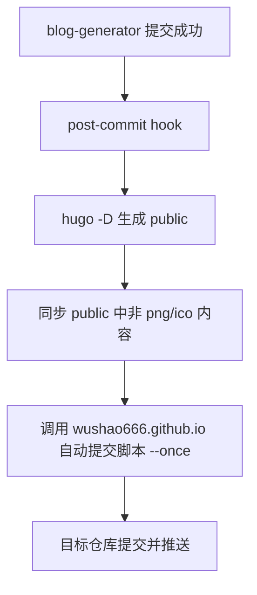

# AGENTS.md

## 工程功能

这是一个 Hugo 静态博客源码仓库，用于维护博客配置、文章内容、主题模板和静态资源，并通过 `hugo -D` 生成可发布的 `public/` 目录。

## 关键目录结构

```text
.
├── archetypes/                # Hugo 内容模板
├── content/                   # 博客文章源文件
├── layouts/                   # Hugo 自定义布局模板
├── static/                    # 原样复制到站点的静态资源
├── themes/                    # Hugo 主题
├── public/                    # Hugo 生成的静态站点产物
├── resources/                 # Hugo 构建缓存与资源产物
└── scripts/                   # 本仓库本地自动化脚本
```

## 本地自动化

### 提交后发布到 GitHub Pages 仓库

`scripts/publish-after-commit.sh` 由本仓库的 git `post-commit` hook 触发，在 `blog-generator` 成功产生新提交后执行：

```bash
hugo -D
```

随后脚本会把 `public/` 中除了 `*.png`、`*.ico` 以外的内容复制到同级目录 `../wushao666.github.io/`，只覆盖同名文件和新增文件，不删除目标仓库中已有但本次构建未生成的文件。目标仓库中的 `.git/`、`scripts/`、`AGENTS.md` 与 `CNAME` 会被保留，避免破坏目标仓库自身的版本控制、自动提交脚本、项目文档和 GitHub Pages 自定义域名配置。

设计逻辑：

1. 为什么这样设计：发布动作只应该发生在源码提交成功之后，避免未提交或提交失败的内容被同步到发布仓库。
2. 怎么做的：使用 git `post-commit` hook 调用发布脚本，发布脚本先运行 Hugo 构建，再用 `rsync` 做只覆盖不删除的复制，并排除图片图标文件，同时保护目标仓库的 `CNAME` 和 `AGENTS.md`。
3. 做到了什么样子：每次源码提交后自动生成最新 `public/`，覆盖同步到 `wushao666.github.io`，再调用目标仓库脚本执行一次 `git add -> commit -> push`。

流程图：


